# AWS Scalable Web Application Architecture

This project demonstrates how to deploy a secure and scalable web application architecture on AWS using best practices for networking, security, and auto scaling.

---

# Architecture Diagram

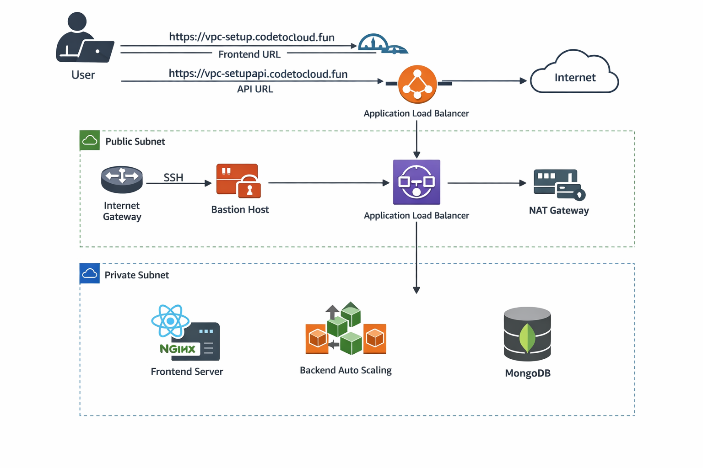

---

# Project Walkthrough

This section explains how the infrastructure was built step by step.

---

# Step 1 – Create VPC

A custom Virtual Private Cloud (VPC) was created to isolate the application infrastructure.

VPC CIDR block:

10.0.0.0/16

All AWS resources for this project are deployed inside this VPC.

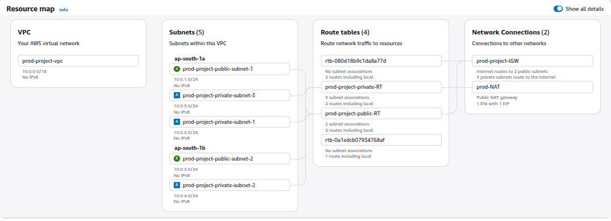

---

# Step 2 – Create Public and Private Subnets

Inside the VPC, both public and private subnets were created.

Public subnet resources:

* Bastion Host
* Application Load Balancer
* NAT Gateway

Private subnet resources:

* Frontend Server
* Backend API Servers
* MongoDB Server

This architecture improves security because application servers are not directly accessible from the internet.

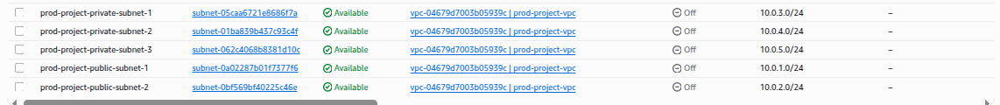

---

# Step 3 – Configure Internet Gateway

An Internet Gateway was attached to the VPC to allow internet access for public resources.

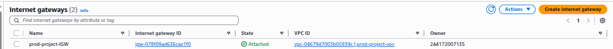

---

# Step 4 – Configure NAT Gateway

A NAT Gateway was deployed in the public subnet.

Private subnet instances use this NAT Gateway to access the internet for updates and package installation.

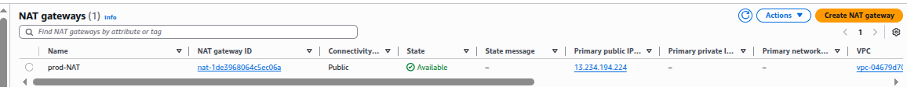

---

# Step 5 – Configure Route Tables

Route tables control how network traffic flows inside the VPC.

Public Route Table routes internet traffic through the Internet Gateway.

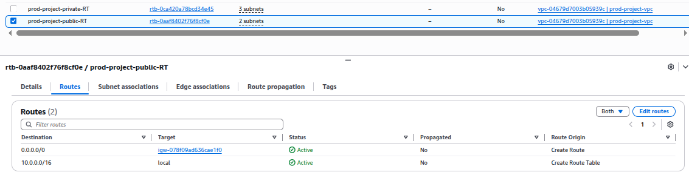

Private Route Table routes outbound traffic through the NAT Gateway.

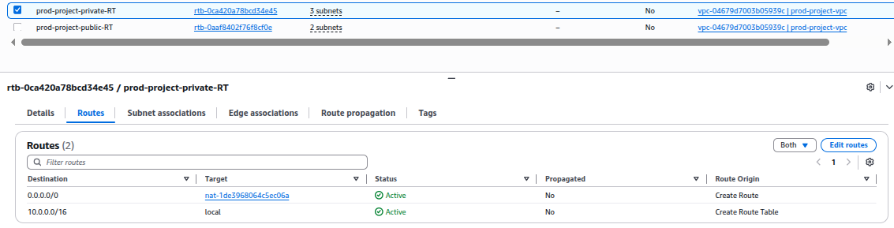

---

# Step 6 – Deploy EC2 Instances

Multiple EC2 instances were launched for different components of the system.

Instances include:

* Bastion Host
* Frontend Server
* Backend Server
* MongoDB Server

All application servers run inside private subnets.

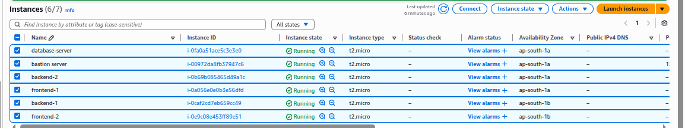

---

# Step 7 – Configure Security Groups

Security groups were configured to control traffic between components.

ALB Security Group allows inbound HTTP and HTTPS traffic.

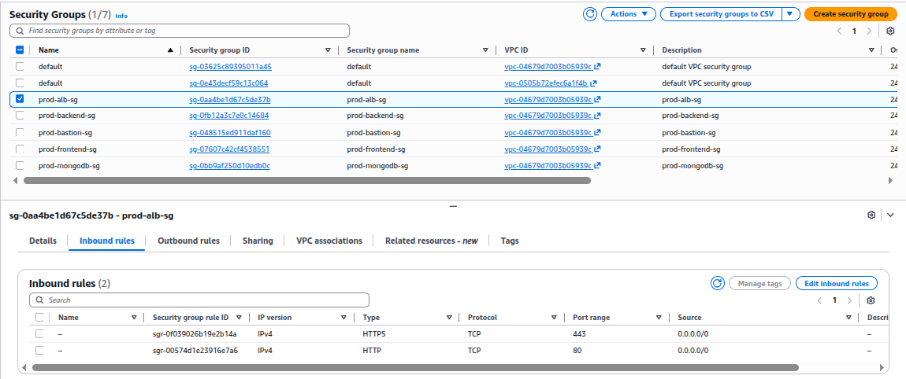

Backend Security Group allows traffic only from the load balancer.

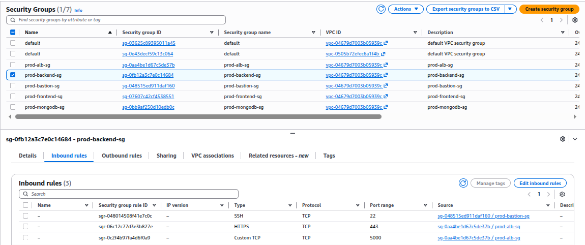

MongoDB Security Group allows traffic only from backend servers.

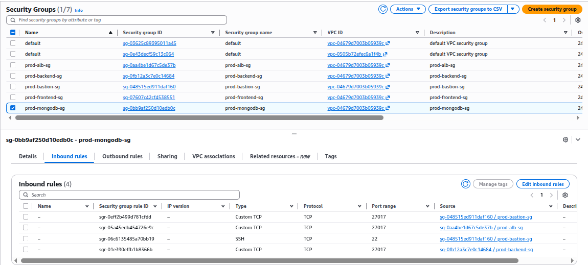

Bastion Security Group allows SSH access.

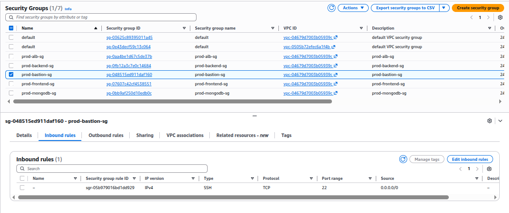

---

# Step 8 – Create Application Load Balancer

An Application Load Balancer was created to distribute incoming traffic.

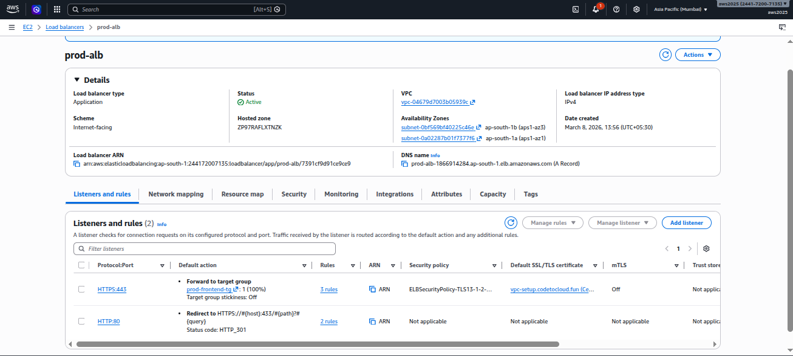

---

# Step 9 – Configure Load Balancer Listeners

HTTP Listener (Port 80)

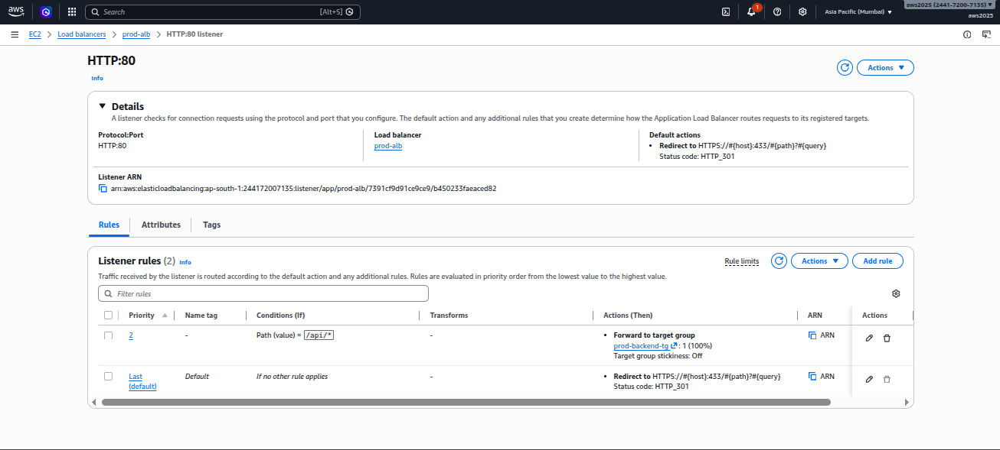

HTTPS Listener (Port 443)

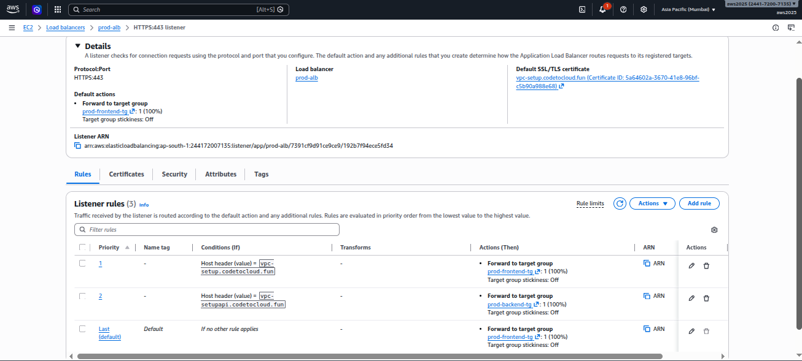

---

# Step 10 – Configure Target Groups

Two target groups were created.

Frontend Target Group routes traffic to the frontend server.

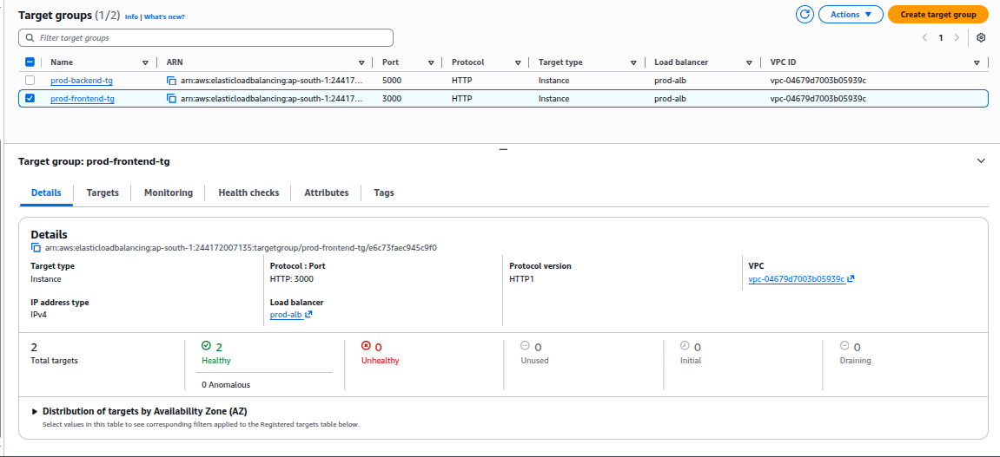

Backend Target Group routes traffic to backend API servers.

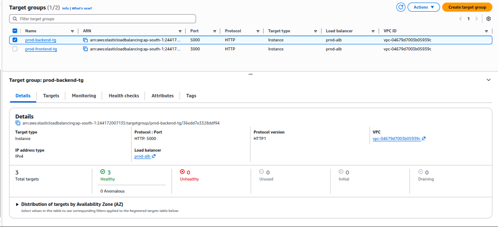

---

# Step 11 – Configure SSL Certificate

SSL certificates were created and validated to enable HTTPS communication.

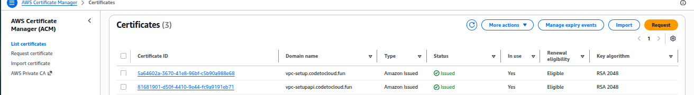

---

# Step 12 – Configure Auto Scaling

Backend servers are managed using an Auto Scaling Group.

Configuration:

Minimum Instances: 1
Desired Instances: 1
Maximum Instances: 3

This allows backend servers to scale automatically during high traffic.

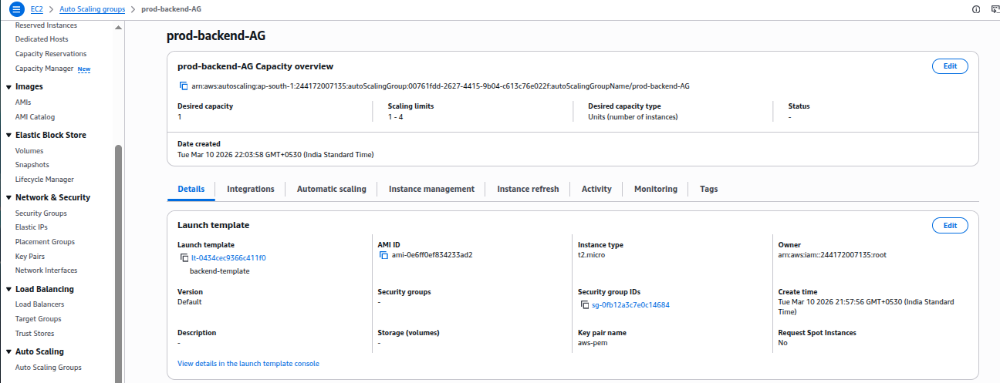

---

# Step 13 – Create Launch Template

A launch template was created using the backend AMI.

This ensures that new Auto Scaling instances start with the backend application already installed.

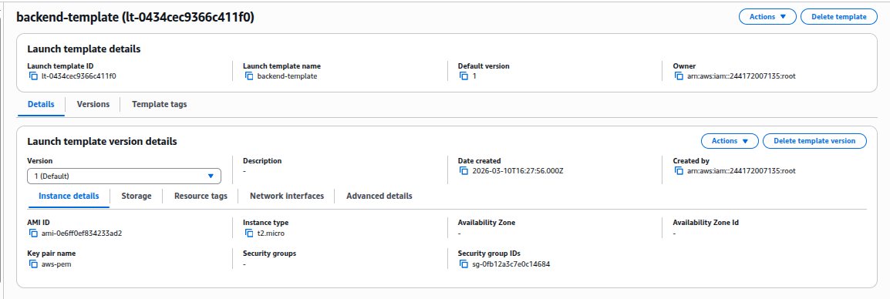

---

# Step 14 – Configure Scaling Policy

Scaling policies were configured based on CPU utilization.

If CPU usage exceeds the threshold, the Auto Scaling Group launches a new backend instance automatically.

When load decreases, extra instances are terminated.

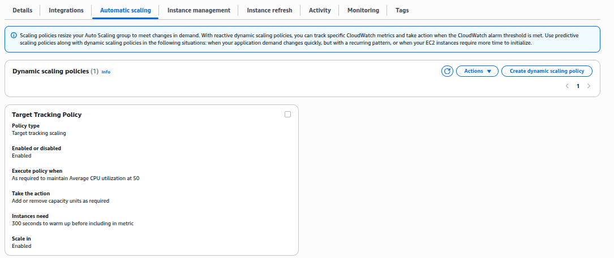

---

# Author

Sharan Kumar
DevOps Engineer
India
